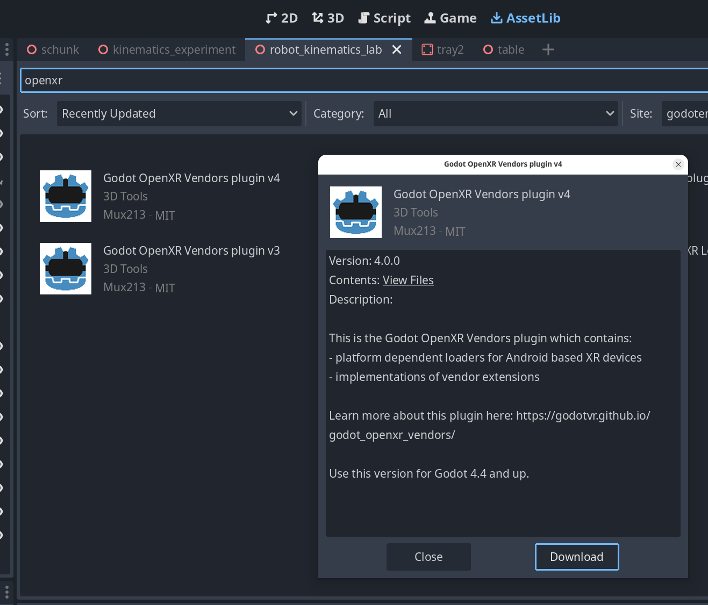
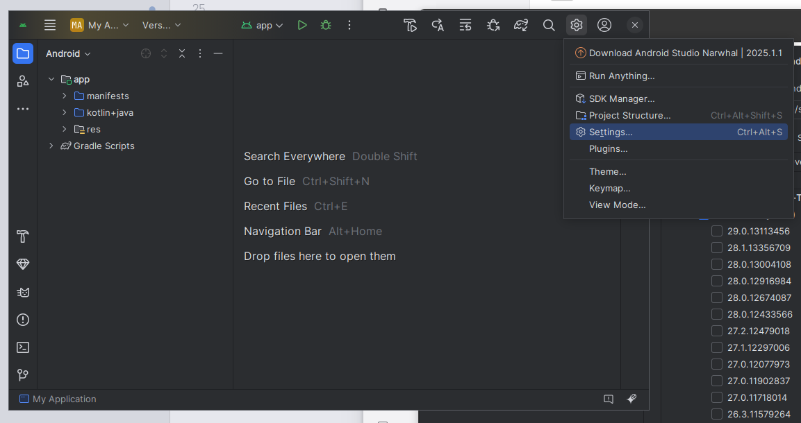
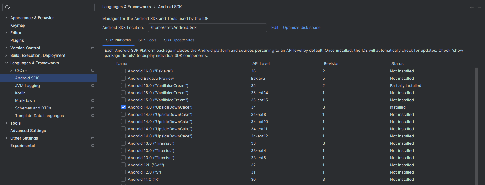
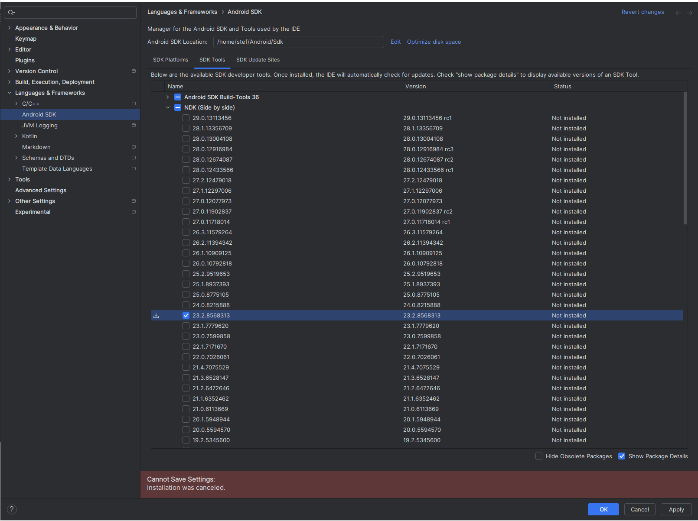
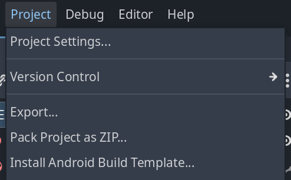
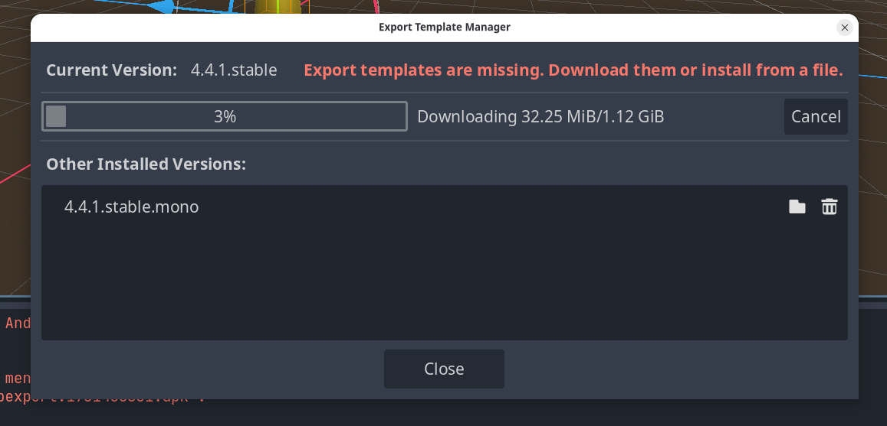
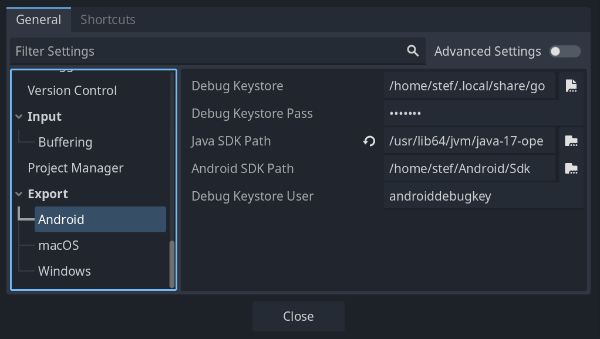
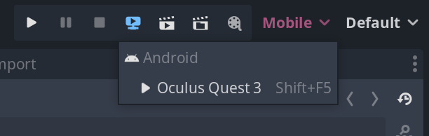

# *Robotic Sandbox* Godot project

**WIP**

This project is a minimal example of an application that demonstrates bindings to the [Mannequin](https://github.com/biomechanics-foundation/mannequin)
crate--a Rust library for computing inverse kinematics--for the [Godot](https://godotengine.org/download/linux/) (4.4.1)
game engine and how to build, export and run on the standalone [Meta Quest 3]() AR/VR glasses. This project has been presented
at the [Rust Hack and Learn Meetup in Karlsruhe on July 3, 2025](https://www.meetup.com/rust-hack-learn-karlsruhe/events/308328739/)
in Karlsruhe, Germany.

## Instructions

The instructions are still incomplete and need to be polished. It assumes that you are using (Arch/Endeavour) linux but might be applicable
on other platforms

* Install [godot 4.4.1](https://godotengine.org/download/linux/) (never versions might work),
  [Rust](https://www.rust-lang.org/tools/install) and OpenJDK (17).

  On Arch/Endeavour run:

  ```sh
  sudo pacman -S godot-mono
  sudo pacman -S rustup
  rustup install stable
  sudo pacman -S jdk17-openjdk # For rust/godot on android
  ```

* Note: A reload might be required in between the following steps (after installing plugins for instance)
* Install Addons
  * [XR Tools](https://github.com/GodotVR/godot-xr-tools) (~30 MB) are a submodule in this repository and should install

  * Install [OpenXR Vendor Plugins @ 4.0.0-stable](https://github.com/GodotVR/godot_openxr_vendors/tree/4.0.0-stable#) via the asset library (~30 MB)

    

  * Submodules?
* Download [Android NDK r23c](https://github.com/android/ndk/wiki/Unsupported-Downloads)

  Set linker paths to the install folder and build:

  ```bash
  export CLANG_PATH = "/home/user_biomech/godot/android-ndk-r23c/toolchains/llvm/prebuilt/linux-x86_64/bin/clang"
  export CARGO_TARGET_AARCH64_LINUX_ANDROID_LINKER = "/home/user_biomech/godot/android-ndk-r23c/toolchains/llvm/prebuilt/linux-x86_64/bin/aarch64-linux-android31-clang"
  cargo build --target=aarch64-linux-android --release
  ```

  ```nu
  $env.CLANG_PATH = "/home/user_biomech/godot/android-ndk-r23c/toolchains/llvm/prebuilt/linux-x86_64/bin/clang"
  $env.CARGO_TARGET_AARCH64_LINUX_ANDROID_LINKER = "/home/user_biomech/godot/android-ndk-r23c/toolchains/llvm/prebuilt/linux-x86_64/bin/aarch64-linux-android31-clang"
  cargo build --target=aarch64-linux-android --release
  ```

* Download [Android Studio](https://developer.android.com/studio). Set it up in the editor config

  * Setup the toolchain in the config 
  * Select the correct SDK 
  * Select the correct NDK 

* Install Android build templates ~ 1.5 GiB.

  * You have to select this option twice (a second time after installing the template)

    
  * Install either `4.4.1.stable` or `4.4.1.stable.mono` depending on your godot version

    

* `editor > editor settings`

  

* Export and run on the headset

  